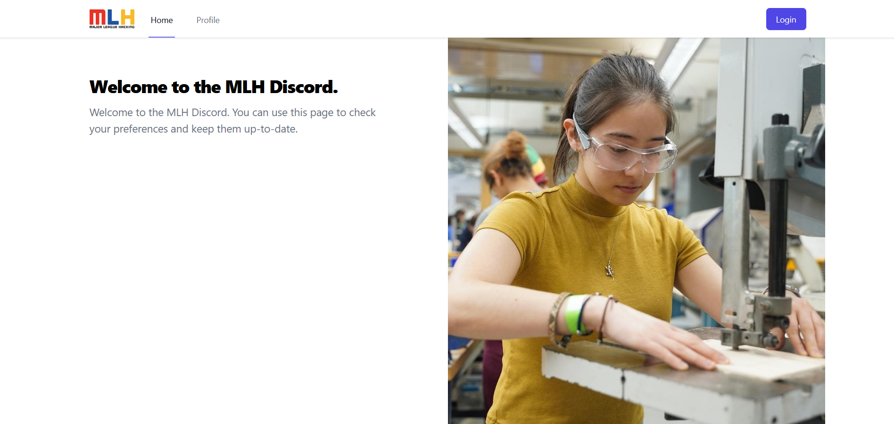
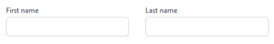
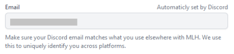
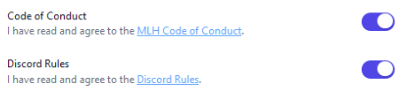
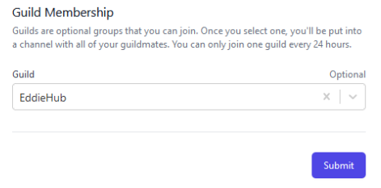

<h1 class="heading-2">What is LHD:&nbsp;share?</h1>
<!-- ALL-CONTRIBUTORS-BADGE:START - Do not remove or modify this section -->

<!-- ALL-CONTRIBUTORS-BADGE:END -->

Local Hack Day: Share is a week-long celebration of sharing everything you’ve learned as a hacker. If you’ve been hacking with us all year, we’re excited to have you back. If this is your very first event, we’ve got a ton of beginner-friendly challenges for you to complete that’ll have you shipping your hack like a pro in no time. You’ll have your pick of technical, design, and social challenges to complete - each with an emphasis on sharing your work. The more challenges you conquer, the more points you’ll earn. Tune in each day to check out the leaderboards and share what you’ve built. 

<h1 align="center"> Join EddieHub in MLH-LHD: Share</h1>

<h2 align="center">1. Go to <a href="https://discord.mlh.io">[MLH-LHD:Share]</a></h2>

 

<h2 align="center">2. Login </h2> 

<h2 align="center">3. Go to the Profile Section & fill the required 
details like this</h2>

<h2 align="center">Add your first and last name</h2>

<h2 align="center">Add your Email</h2>

<h2 align="center">Accept Code of Conduct and Discord rules</h2>

<h2 align="center">Select EddieHub in Guild Membership</h2>

<h2 align="center">Click on Submit !! You are done !!</h2>
  
  
  
 
  

Join EddieHub's discord server, where we geek out <a href="http://discord.eddiehub.org">here</a>

<h3 align="center">PS - you get green squares daily</h3>

## Contributors ✨

Thanks goes to these wonderful people ([emoji key](https://allcontributors.org/docs/en/emoji-key)):

<!-- ALL-CONTRIBUTORS-LIST:START - Do not remove or modify this section -->
<!-- prettier-ignore-start -->
<!-- markdownlint-disable -->
<table>
  <tr>
    <td align="center"><a href="https://github.com/divyakumari12"> <b>Divya Kumari</b></a> <a href="#ideas-divyakumari12" title="Ideas, Planning, & Feedback">🤔</a></td>
  </tr>
</table>

<!-- markdownlint-restore -->
<!-- prettier-ignore-end -->

<!-- ALL-CONTRIBUTORS-LIST:END -->

This project follows the [all-contributors](https://github.com/all-contributors/all-contributors) specification. Contributions of any kind welcome!